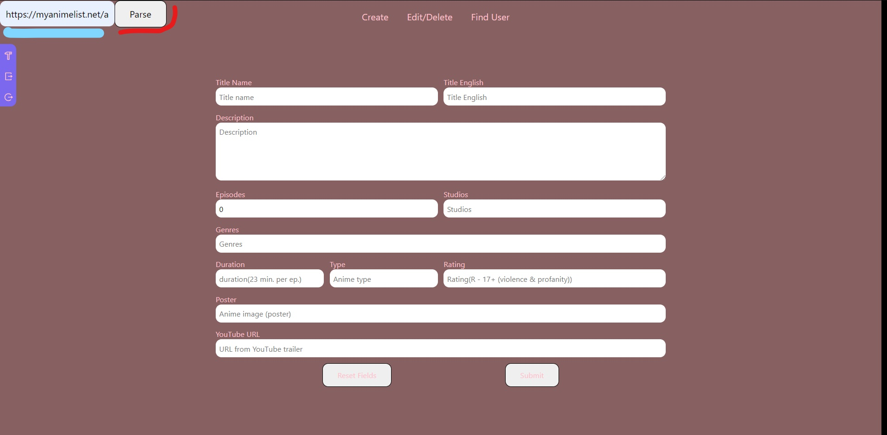
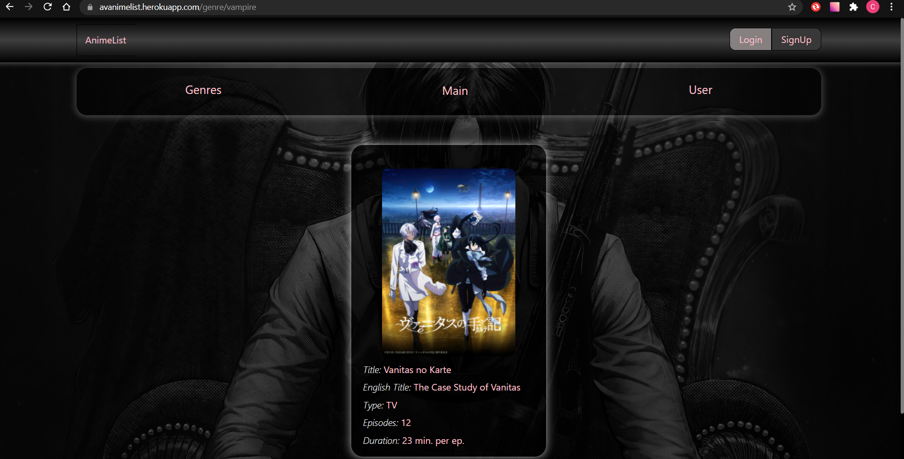

# How AnimeList Work
## User
If you click Sign Up button you will get to Sign Up form.

---
If you click Login button you will get to Login form.

---
User Dropdown Menu.

---
If you click Menu button you will get to user menu.

---
If you click Edit button you will get to user edit form.

---
If you click Delete button you will start user delete form.

---
## Admin

---

Admin Navigation Bar

1. Admin Panel.
2. Admin LogOut. --> if click this button you will logout from admin account.
3. User & Admin LogOut --> if click this button you will logout from User and Admin account.

---

If we click on Admin Panel Button We will be in the navigation bar.

This buttons help you to navigate through admin panel.

---
If you want to create an anime you will we able to put all data in input filds OR you can use input field(BLUE UNDERLINE). Put site URL(*MyAnimeList) and click Parse button. You will need- to wait 8-18s. If You will not get result try another link.

---

After clicking Parse button and waiting a few seconds you will get result(The result is inside the black line).

It is possible that some lines will be blank and some are filled in incorrectly in relation to their names, in which case you will have to correct manually.

Submit button(blue underline) will create an anime.
Reset button(red underline) will reset all input fields.

---
If you want to find anime first of all you will need to input(red underline) correctly enter all name of the anime an only after to click on the button(blue color).

As a result you will get the result(black frame).

Only if you get a relust you will be able to edit(purple color) or delete(pink color) this anime(if you click delete anime it will be deleted instantly).

---
If you want to find user first of all you will need to input(red underline) username  an only after to click on the button(blue color).

As a result you will get the result(black frame).

You will be able to delete user after clicking on the delete button(purple color).

---
## Anime
If you click on anime picture you will go to the current anime page.

---
It's anime page.

---
You can find animes by genre.

